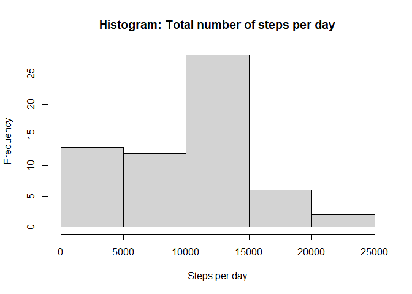
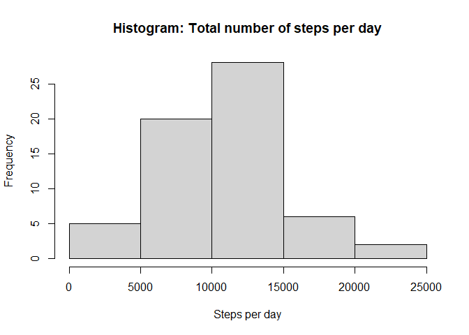
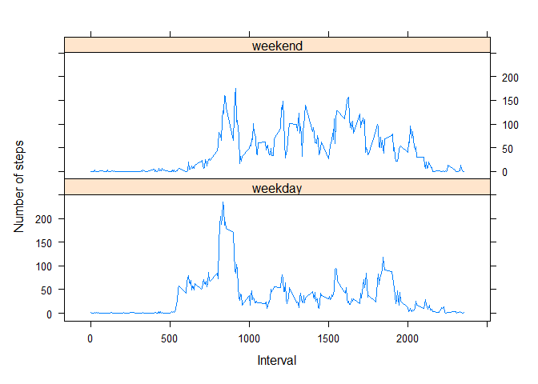

## Loading and preprocessing the data
  
1. Load the data 
2. Process/transform the data (if necessary) into a format suitable for your analysis


```r
data<-read.csv("C:/Users/Susanne Haas/Documents/Coursera/05_Reproducible_Research/Course_Project_1/activity/activity.csv", header=TRUE, sep=",")

data$date <-as.Date(data$date, "%Y-%m-%d")
```

## What is the total number of steps taken per day?

1. Calculate the total number of steps taken per day


```r
t_steps<-tapply(data$steps, data$date, sum, na.rm=TRUE)
```

2. If you do not understand the difference between a histogram and a barplot, research the difference between them. Make a histogram of the total number of steps taken each day


```r
hist(t_steps, main="Histogram: Total number of steps per day", xlab="Steps per day")
```

<!-- -->

3. Calculate and report the mean and median of the total number of steps taken per day


```r
mn <-mean(t_steps, na.rm=TRUE)
print(paste("Mean number of steps per day:", mn)) 
```

```
## [1] "Mean number of steps per day: 9354.22950819672"
```

```r
med<-median(t_steps, na.rm=TRUE)
print(paste("Median number of steps per day:", med)) 
```

```
## [1] "Median number of steps per day: 10395"
```

## What is the average daily activity pattern?

1. Make a time series plot (i.e. type = "l") of the 5-minute interval (x-axis) and the average number of steps taken, averaged across all days (y-axis)


```r
mean_i<-tapply(data$steps, data$interval, mean, na.rm=TRUE)
interval <-unique(data$interval)
plot(interval, mean_i, type="l", xlab="Interval", ylab="Mean number of steps")
```

<!-- -->

2. Which 5-minute interval, on average across all the days in the dataset, contains the maximum number of steps?


```r
max_i<-names(subset(mean_i, mean_i== max(mean_i, na.rm=TRUE)))
```

## Imputing missing values

1. Calculate and report the total number of missing values in the dataset (i.e. the total number of rows with NAs)


```r
nas <-sum(is.na(data$steps))
print(paste("Number of missing values:", nas))
```

```
## [1] "Number of missing values: 2304"
```

2. Devise a strategy for filling in all of the missing values in the dataset. The strategy does not need to be sophisticated. For example, you could use the mean/median for that day, or the mean for that 5-minute interval, etc.

The number of steps per interval very much depends on the time of day.As such, the overall mean of a particular 5-minute interval will be chosen to impute the missing data values.  

3. Create a new dataset that is equal to the original dataset but with the missing data filled in.


```r
data2 <-data
for (i in 1:17568){
  if (is.na(data2$steps[i]) == TRUE) {
    j<-data2$interval[i]/5+1
  data2$steps[i] <-mean_i[j]
}
}
```

4. Make a histogram of the total number of steps taken each day and Calculate and report the mean and median total number of steps taken per day. Do these values differ from the estimates from the first part of the assignment? What is the impact of imputing missing data on the estimates of the total daily number of steps?


```r
t_steps2<-tapply(data2$steps, data2$date, sum, na.rm=TRUE)
hist(t_steps2, main="Histogram: Total number of steps per day", xlab="Steps per day")
```

<!-- -->


```r
mn2 <-mean(t_steps2, na.rm=TRUE)
print(paste("Mean number of steps per day:", mn2)) 
```

```
## [1] "Mean number of steps per day: 10282.14290133"
```

```r
med2<-median(t_steps2, na.rm=TRUE)
print(paste("Mean number of steps per day:", med2))
```

```
## [1] "Mean number of steps per day: 10395"
```

```r
diff_mn <- mn-mn2
diff_med <- med-med2
print(paste("Difference regarding the mean:", diff_mn)) 
```

```
## [1] "Difference regarding the mean: -927.913393133314"
```

```r
print(paste("Difference regarding the median:", diff_med)) 
```

```
## [1] "Difference regarding the median: 0"
```

## Are there differences in activity patterns between weekdays and weekends?

1. Create a new factor variable in the dataset with two levels – “weekday” and “weekend” indicating whether a given date is a weekday or weekend day.


```r
data$weekday <-weekdays(data$date)

data$weekday[data$weekday=="Montag"]<-"weekday"
data$weekday[data$weekday=="Dienstag"]<-"weekday"
data$weekday[data$weekday=="Mittwoch"]<-"weekday"
data$weekday[data$weekday=="Donnerstag"]<-"weekday"
data$weekday[data$weekday=="Freitag"]<-"weekday"
data$weekday[data$weekday=="Samstag"]<-"weekend"
data$weekday[data$weekday=="Sonntag"]<-"weekend"

data$weekday<-as.factor(data$weekday)
```

2. Make a panel plot containing a time series plot (i.e. type = "l") of the 5-minute interval (x-axis) and the average number of steps taken, averaged across all weekday days or weekend days (y-axis). See the README file in the GitHub repository to see an example of what this plot should look like using simulated data.


```r
library(lattice)
wd<-subset(data, data$weekday=="weekday")
we<-subset(data, data$weekday=="weekend")
mean_wd<-tapply(wd$steps, wd$interval, mean, na.rm=TRUE)
mean_we<-tapply(we$steps, we$interval, mean, na.rm=TRUE)
plotdata<-data.frame(c(interval, interval), c(mean_wd, mean_we), c(rep("weekday",288),rep("weekend", 288)))
names(plotdata) [1]<-"interval"
names(plotdata) [2]<-"mean"
names(plotdata) [3]<-"weekday"
xyplot(plotdata$mean ~ plotdata$interval |plotdata$weekday, data=plotdata, type = "l", xlab = "Interval", ylab="Number of steps", layout=c(1,2))
```

<!-- -->
